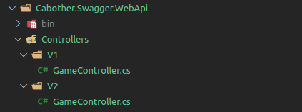

# Cabother-Swagger

Biblioteca de apoio ao uso de swagger em api's

## Nuget
```
https://www.nuget.org/packages/Cabother.Swagger.UI/
```
## Como configurar?

- Adicionar no projeto do tipo webapi, o pacote do [nuget](https://www.nuget.org/packages/Cabother.Swagger.UI/)

- Executar retore das dependências instaladas através do comando:
  -  `dotnet restore`

- No seu arquivo `startup.cs` adicionar o seguinte using:
  -  `using Cabother.Swagger.UI.Extensions;` 

- No seu método `ConfigureServices(IServiceCollection services)` adicionar a seguinte informação:
  - ```
    services.AddControllers();
    services.AddDocumentations(Configuration);
    ```

- No seu método `Configure(IApplicationBuilder app, IWebHostEnvironment env)`:
  - Alterar para receber também um terceiro parâmetro:
    - ```
        Configure(IApplicationBuilder app, IWebHostEnvironment env, IApiVersionDescriptionProvider provider)
        ```
    - Agora, dentro deste método acima, adicionar a seguinte informação:
      - ```
        app.UseEndpoints(endpoints =>
            {
                endpoints.MapControllers();
            });

        app.UseDocumentations(provider);
        ```

- Em suas controllers, agora deverá separá-las por pastas distintas, sendo cada pasta o nome da versão correspondente:
  - 

- Agora falta apenas um pequeno passo, em suas respectivas controllers basta adicionar as seguintes informações:
  - ```
    [ApiVersion("1")]
    [ApiExplorerSettings(GroupName = "v1")]
    [Route("api/v{version:apiVersion}/games")]
    [ApiController, Produces(MediaTypeNames.Application.Json)]
    public class GameController : ControllerBase
    {
        ... conteúdo
    }
    ```
    Lembrando que o `[ApiExplorerSettings(GroupName = "v1")]` será o agrupador no swagger, sendo assim você poderá ter diferentes GroupNames, tais como "V1", "V2"...e assim por diante.

- Agora, basta iniciar seu projeto com o seguinte comando:
  - `dotnet run`

- Seu resultado será visível na porta default 5000 / 5001, exemplo: `https://localhost:5001/swagger` 
    - 

Por padrão a documentação está disponível no endpoint `/swagger` . A documentação pode ser customizada a partir do arquivo `appsettings.json' alterando a seção exemplificada abaixo:

```json
{
  "ApiDocumentation": {
    "AppName": "Nome da sua API",
    "Description": "Descrição da sua API",
    "Owner": "Seu Nome",
    "Email": "seuemail@seudominio.com",
    "DocJson": "/swagger/v1/swagger.json",
    "DocRoute": "swagger"
  }
}
```